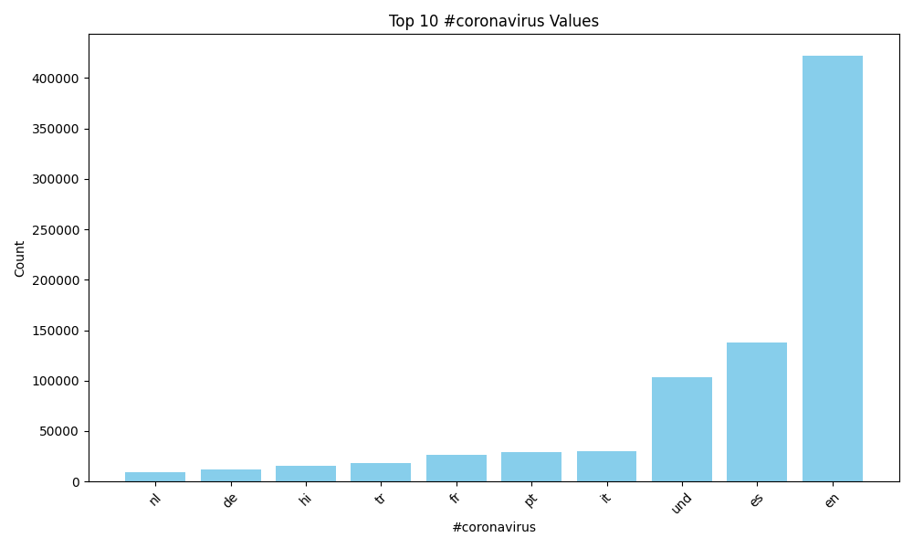
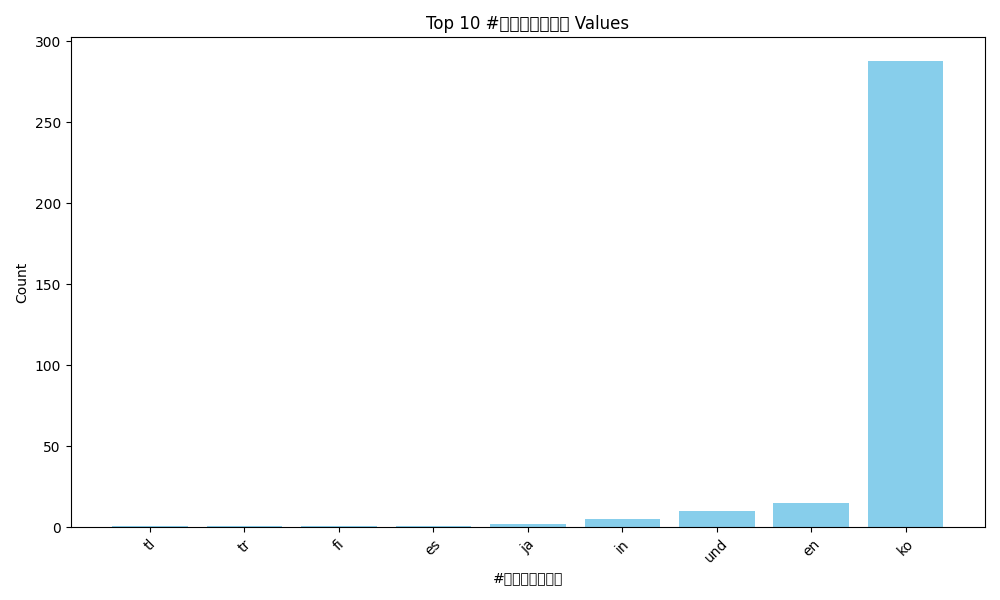
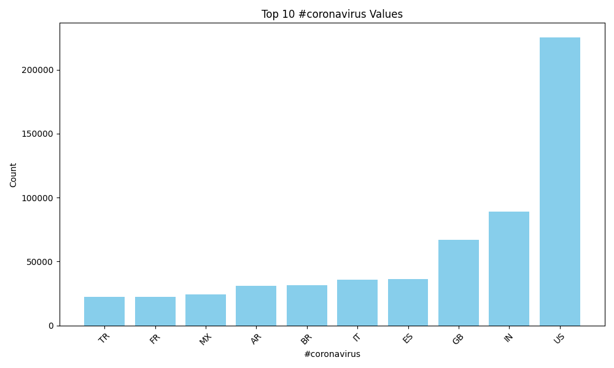
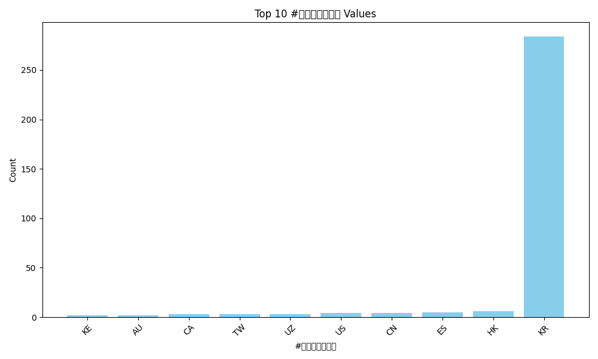
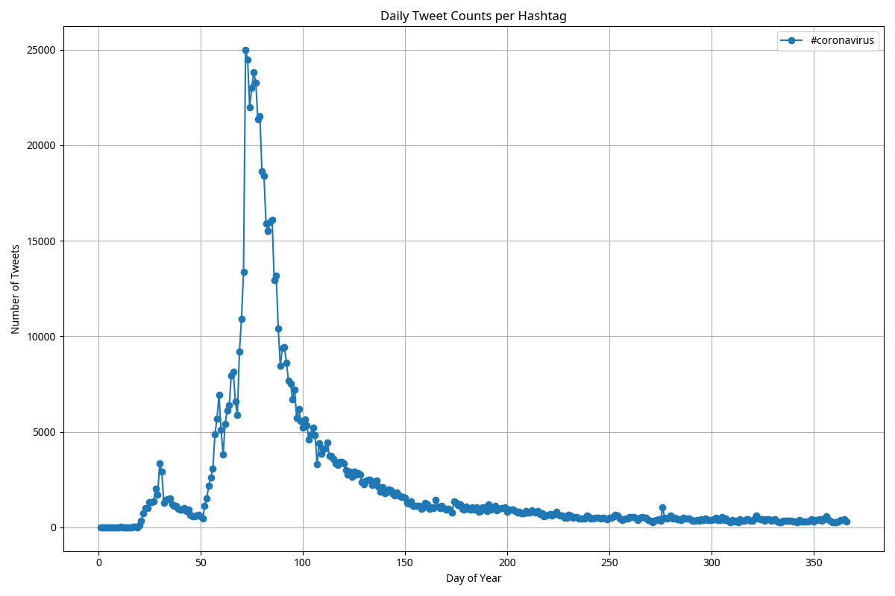
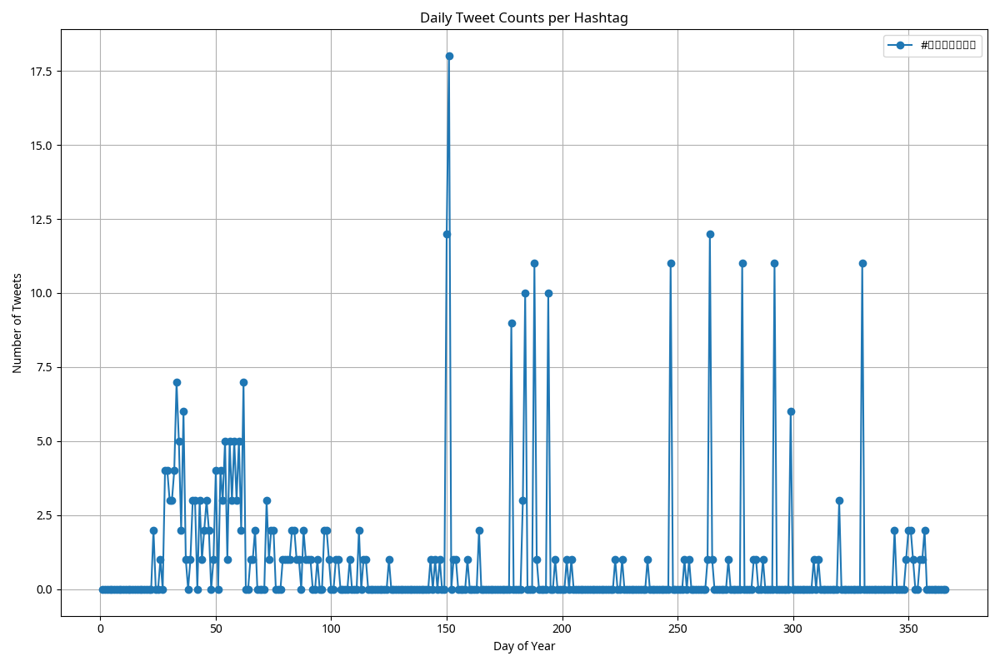
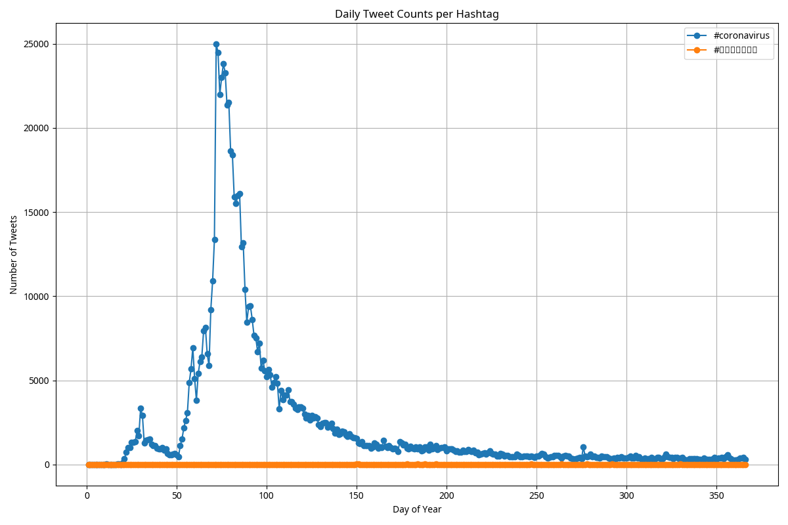

Coronavirus Twitter Analysis
============================

This project analyzes geotagged tweets from 2020 to monitor the spread of the coronavirus on social media. It uses a MapReduce framework to process a very large dataset of tweets (approximately 1.1 billion tweets from 2020) to extract meaningful social media trends relating to the pandemic. 

**Project Learning Objectives:**
- Work with large-scale datasets.
- Process multilingual text.
- Use the MapReduce divide-and-conquer paradigm to write parallel code.

**Project Background:**

- **Data:**  
  Approximately 500 million tweets are sent every day. About 2% of these tweets are geotagged, meaning they include location information. The tweets are stored as daily zip files (e.g., `geoTwitter20-02-14.zip`), each containing 24 hourly text files. Each line of a text file is a tweet in JSON format.

- **MapReduce:**  
  The tweets are processed in two steps:
  - **Mapping:**  
    Each tweet is processed to extract language and country-level information, as well as counts for specific hashtags.
  - **Reducing:**  
    The outputs from the mapper are then aggregated (summed element-wise) to produce overall counts for each hashtag.

**Generated Plots:**

The following PNG files have been generated as a result of the analysis:
1. **lang_coronavirus.png:** A bar graph showing the top 10 languages for tweets containing `#coronavirus`.

2. **lang_코로나바이러스.png:** A bar graph showing the top 10 languages for tweets containing `#코로나바이러스`.

3. **country_coronavirus.png:** A bar graph showing the top 10 countries for tweets containing `#coronavirus`.

4. **country_코로나바이러스.png:** A bar graph showing the top 10 countries for tweets containing `#코로나바이러스`.

## Alternative Reduce Line Plots

The following line plots were generated using the alternative reduce procedure. Each plot shows the daily tweet counts for the respective hashtags over 2020, with the x-axis representing the day of the year and the y-axis representing the number of tweets.

### Plot for `#coronavirus`

**Description:**  
This plot shows the daily tweet counts for the hashtag `#coronavirus` in English. It highlights how the volume of tweets containing this hashtag fluctuated over the year, reflecting public interest and discussion trends regarding the coronavirus.

### Plot for `#코로나바이러스`

**Description:**  
This plot displays the daily tweet counts for the hashtag `#코로나바이러스` in Korean. It provides insights into the usage pattern of the Korean version of the hashtag, illustrating how discussions in Korean evolved over time.

### Combined Plot for `#coronavirus` and `#코로나바이러스`

**Description:**  
This combined plot overlays the daily tweet counts for both `#coronavirus` and `#코로나바이러스`. It allows for a direct comparison between the English and Korean hashtags, revealing trends and potential differences in the way these hashtags were used throughout the year.

This project demonstrates the application of MapReduce techniques to real-world, large-scale social media data, and showcases the ability to work with diverse languages and parallel data processing methods.

---
